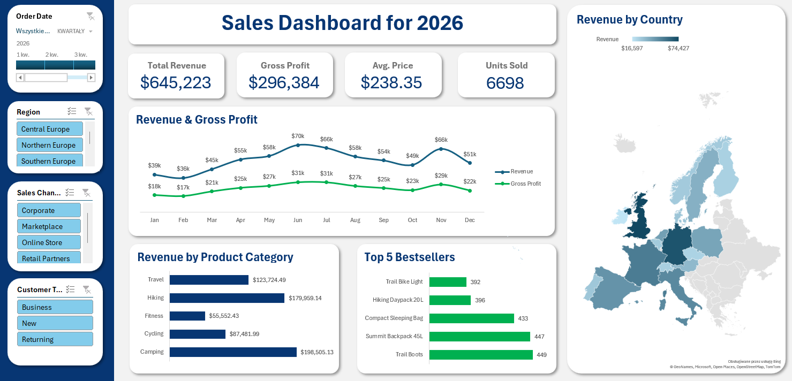

# 📊 Sales Dashboard 2026

Interaktywny dashboard sprzedażowy stworzony w Microsoft Excel. Projekt został przygotowany w celu analizy wyników sprzedaży oraz przedstawienia najważniejszych wskaźników biznesowych w przejrzystej i łatwej do analizy formie. Dashboard umożliwia analizę danych według czasu, regionu, kanału sprzedaży oraz typu klienta.

---

## 🎯 Cel projektu

Celem projektu było stworzenie interaktywnego dashboardu, który pozwala szybko monitorować wyniki sprzedaży i analizować najważniejsze obszary działalności.

Dashboard umożliwia m.in.:

- monitorowanie całkowitego przychodu,
- analizę zysku brutto,
- śledzenie sprzedaży w ujęciu miesięcznym,
- porównanie przychodów pomiędzy krajami,
- analizę wyników poszczególnych kategorii produktów,
- identyfikację najlepiej sprzedających się produktów,
- analizę różnych kanałów sprzedaży,
- porównanie nowych i powracających klientów.

---

## 📸 Podgląd dashboardu

